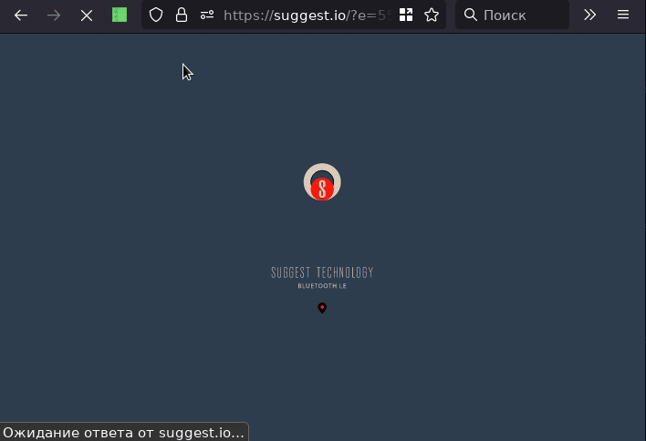

# Suggest.io: Your offer may be here

Suggest.io is conceptual solution to simply create rich eye-candy cross-screen content and
simply attach it to physical locations via:
- [NFC tags](doc/tech/nfc.md)
- [Wi-Fi zones](doc/tech/wifi.md)
- Geographical regions on the map
- [Bluetooth radio-beacons (EddyStone technology)](doc/tech/bluetooth-beacons.md)
- Internal nodes graph hierarchy
- etc.

## Contents

- [About](#about)
- [Goals](#goals)
- [Requirements](#requirements)
  - [Runtime](#runtime)
  - [Development](#development)
- [Getting started](#getting-started)

## About

Suggest.io is an CMS-like + Web + Hybrid Mobile App solution over ElasticSearch storage, used to create design-rich
screen-fit single-page Web, composed into unified nodes graphs and contexted into radio-beacon signals,
geolocation regions, nodes graph, etc. Content placements can be monetized using build-in billing system.

Server, client and shared code written on Scala.
Client-side UI developed using [scalajs-react](https://github.com/japgolly/scalajs-react/)
and translated into JavaScript using [Scala.js](https://www.scala-js.org/) compiler.
Server-side code based on [Play! framework](https://playframework.com/).

Some small parts contains non-scala code due to historical reasons.

## Goals
- Create a simple representation into the internet for end-users.
  Currently, sites+domains+certificates+programmers+html+designers+etc+etc have
  high and raising cost for small/middle business.
- More content dimensions.
  Current usual Internet structured into sites, and pages mapped into URLs.
  Content may be also transparently attached to radio-beacon signals (Wi-Fi, bluetooth, etc), geographical regions, NFC-tags, etc.
  Abstract out from virtual and physical dimensions.
- Extended navigation dimensions: usual site page-to-page navigation may be extended via extending current content view
  with new content.
- Page can contain apps, app can show pages. Single-page view can become app. Abstract over browsers and apps.
- Many screens -- one content. Abstract over mobiles, tables and PCs screens. Be responsible.
- Become distributed. Current implementation designed with horizontal cluster scaling in mind.
  In future become more federated/distributed using blockchains/git/activitypub/etc as underlying storage.

## Requirements

### Runtime
TODO Pre-build images/binaries not-yet ready, so see [Development](#development).
- Java 8-15
- sbt 1.3+
- ElasticSearch 7 - Distibuted primary storage.
- PostgreSQL (Used for billing)
- SeaWeedFS (Distributed storage for pictures and other files)
- ImageMagick

### Development
- sbt 1.3+
- scala 2.13+
- Node.js

## Getting started
0. Install needed system packages:
  - `pikaur -Sy jdk-openjdk imagemagick sbt elasticsearch-xpack postgresql seaweedfs`
1. Ensure elasticsearch, postgresql, seaweedfs master and volumes started.
2. Go to main server sub-directory:
  - `cd src1/server/www`
2. Install postgresql schema:
  - `cat evolutions/default/schema.sql | sudo -U postgres psql`
3. Create server config:
  - `cp conf/application.conf.example conf/application.conf`
4. Edit `appliction.conf` file according to your needs. Type your admin email into `superusers.emails`.
5. Start the server:
  - `sbt`
  - `project www`
  - `run`
    Command `run` used for dev-mode.
    `runProd` for production,
    `stage` to compile production tarball into `server/www/target/universal/` directory.
6. See console log for created superusers with email typed at step 4.
7. Open browser, go to [login page](http://localhost:9000/id). Wait for compilation finishes. Type login/password from step 6.
8. Superuser also have access to special [/sys/ pages](http://localhost:9000/sys).

