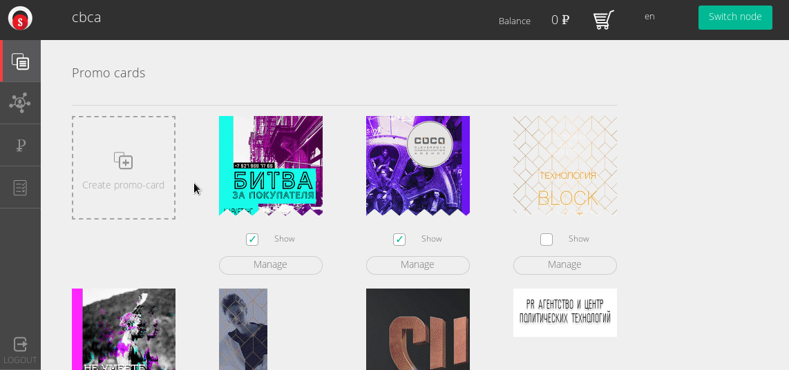

# Geo advertising
In current context, "advertising" means placing some content to other-party's geographical area or node,
registered in Suggest.io system. Usually, advertising is temporal and paid.

Suggest.io cabinet supports simply user-interface to powerful internal advertising mechanism.

## Geo-area advertising
Content can be placed inside the map area. All end-users of web-browsers and Suggest.io can see such content,
if user has been automatically geolocated into area or moved into it manually.

## Node-level advertising
Form supports advertising inside Suggest.io nodes and its subnodes.

For example, some third-party shop have geolocation on the map, and have [Bluetooth](../bluetooth-beacons.md)
and [Wi-Fi radio-beacons](../wifi.md) inside it.
Other Suggest.io users can advertise its own content inside this shop. Look at demo:

For end-users, [showcase](../showcase/showcase.md) will show advertised content for users geolocated into shop
(GPS, GLONASS, etc).

For end-users nearby radio-beacons inside building areas content also will be visible, if such node has been selected
during advertising. Note: radio-beacons scanning/location no supported inside web-browser: it needs suggest.io app installed.

Also, link to any node could be written into [NFC-tag](../nfc.md), so any end-user can scan NFC tag and see
content in web-browser or Suggest.io application, if installed.

If you need to register your Wi-Fi/Bluetooth/radio-signals as your nodes, take a look to
[Suggest.io mobile app. radio-scanner](../showcase/nodes.md#registering-radio-beacon).

## Tags advertising
Any ads can be categorized via tags mechanism in all levels: tags can be placed on map, inside nodes, etc.
Tags are much cheaper than publication on main screen and helps system to organize content,
and end-users can search for interesting items via text search.

Of course, any content can be published in one or more tags and on main screen at once.
