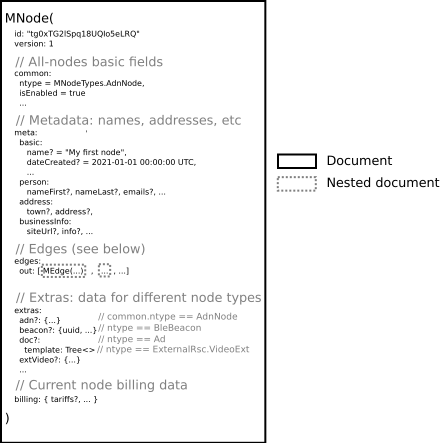

# MNode model
Every node stored using `MNode`.

`MNode` documents used to represent most of the information of the Suggest.io system.

## Node types
All nodes are typed using `common.ntype` field. Depending on type, some optional MNode.* fields become mandatory.

### MNodeTypes.Person
User node type.
When a new user sign-ups, `Person`-typed node is created.
Person node edges contains MPredicates.Ident.`Email`, `Phone` and `Password` edges.
Some user personal information may be saved into `meta.person`.

### MNodeTypes.AdnNode
So-historically-called "*AdN*etwork Node" is an aggregation node between Person and Ad-nodes.
For example, one have a shop. Shop have its address, its design (colors), photo-gallery, etc.
AdnNode do the job, storing information about shop.

AdnNode may be placed on geo.map area. Visitors of Suggest.io inside that area will be automatically geolocated
into this AdnNode, and ads of such node will be displayed to users.

`extras.adn` field contains object with some node params.
`meta.*` objects contains node metadata (like name, address, description, etc).

### MNodeTypes.Ad
Ad card node is visual content element.

`extras.doc` contains template -- the tree structure of [JdTags](../../../src1/shared/common/shared/src/main/scala/io/suggest/jd/tags/JdTag.scala)
(Json Document tag), describes content in abstract way: blocks, content, image, etc.

Template content like texts, images, video/frames, etc stored inside edges, and template contains edge uids for such edges.

Also, ad-node edges contains advertising information: displaying in the tags, in geo.shapes, on other nodes
(including bluetooth beacons), etc. See [MNodePredicates](../../../src1/shared/common/shared/src/main/scala/io/suggest/n2/edge/MPredicates.scala)
about predicates like `TaggedBy`, `AdvGeoPlace`, `Receiver.Paid`, etc.

### MNodeTypes.Tag
Automatically created tag-nodes for advertising in tags and geo.tags.
It contains aggregated indexed information about geo.shapes from all tagged ad nodes.

### MNodeTypes.Media
Media-node means a file-node. File metadata stored inside `MEdge(predicate=Blob.File).media.*`.
During upload, such media edge contains current file parts information inside edges predicated with `Blob.Slice`.

### MNodeType.BleBeacon
Bluetooth LE Beacon type used to describe physical bluetooth radio-beacon.
`_id` of such node matches full beacon id string.
`extras.beacon` may contain some additional information about beacon.

### MNodeTypes.ExternalRsc.VideoExt
External video-resource node, related to known video service.
For example, in is used to store information about embedded video frame.
`extras.extVideo` contains information about external video.

### MNodeTypes.ExternalRsc.Resource
External resource node, related to some URL.
`external.resource` contains all needed field.
