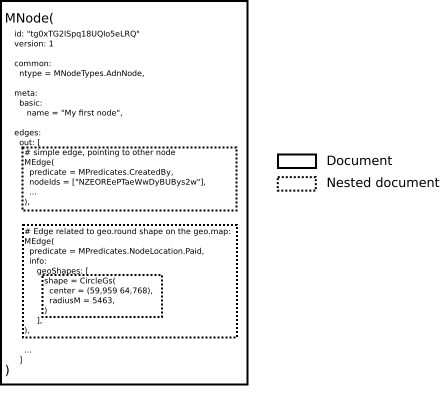

# MEdge model

MEdge is very abstract extensible data structure to represent some data inside MNode.
On ElasticSearch-side, every MEdge stored as nested-document, described as JSON object structure.

Edges are typed (`predicate` field).
Edge can point to none, one or many other nodes.
Edge can point to many or zero nodes.
Edge can point to geo.point and/or geo.shape on the geo.map, and geoshapes also stored as nested documents inside edge.
Edge can point to node(s) in context of geo.shape.
Edge can have edge-flags.
Edge may store indexed file metadata.
Edge can store moderation status.
Edge can store, index and fulltext-search #tags.
Edge can store text, used for furner HTML-rendering.
Edge may have integer uid to identify it between other edges.
Etc, etc, etc.

## Edge predicates
As said earlier, edges are typed using `predicate` field. This is the only mandatory field for `MEdge`.
`MPredicates` hierahical model contains enum of possibly `predicate` field values.

Some basic edge predicates:
### MPredicates.CreatedBy
Edge points to original creator (usually, a `Person`) of current node.
`nodeIds` contains id of node of creator.

### MPredicates.OwnedBy
Edge describes management rights over current node.
`nodeIds` contains id of owner node (usually, a `Person`).

### MPredicates.ModeratedBy
Edge represents moderator's verdict for current node.
`nodeIds` contains id of moderator,
`info.flag` and `info.commentNi` contains moderation verdict details.

### MPredicates.Receiver.AdvDirect
Current Ad node is paid-advertized on nodes in `nodeIds` set.

### MPredicates.TaggedBy.AdvGeoTag
Current Ad node is paid-advertized in geo.tag in the geo.map area.
Tag face (tag text after #-diez) full-text-indexed in `info.tagFace`, tag node id strored in `nodeIds`,
and geo.area shape -- in `info.geoShape` fields.

### MPredicates.TaggedBy.DirectTag
Current Ad node is paid-advertized in tag on the node.
Node id and Tag node id stored in `nodeIds`.
Tag name FTS-indexed in `info.tagFace`.

### MPredicates.AdvGeoPlace
Current Ad is paid-adverized in the geo.map area.
`info.geoShape` contains geo.area shape.

### MPredicates.JdContent.Text
Some text string stored in `doc.text`.
JD-tag inside template tree `MNode().extras.doc.template` contains edgeUid-field matching current edge's `doc.id`.
Text is used by Ad's template renderer: text data is separated out from template structure for possible future needs.

### MPredicates.JdContent.Image
Current edge points to picture node.
JD-tag inside template tree `MNode().extras.doc.template` contains edgeUid-field (with possible additional rendering options) matching current edge's `doc.id`.
`nodeIds` contains id of related image node.

### MPredicates.Ident.Email
Edge `nodeIds` contains raw email string for login purposes.
Current node have `common.ntype` == `MNodeTypes.Person`.

### MPredicates.Ident.Password
`info.textNi` contains hashed password.

### MPredicates.Blob.File
Current edge `media` field contains file metadata.
File contents blob stored inside distributed object storage (SeaWeedFS or other).
`nodeIds` may contain id of other file node, if current file has been generated for other original file.

### MPredicates.ShortUrl
Current edge describes short URL payload in `nodeIds`. URL directs to current node.

There are other predicates.
See [MPredicates](../../../src1/shared/common/shared/src/main/scala/io/suggest/n2/edge/MPredicates.scala)
for all current tree predicates.
